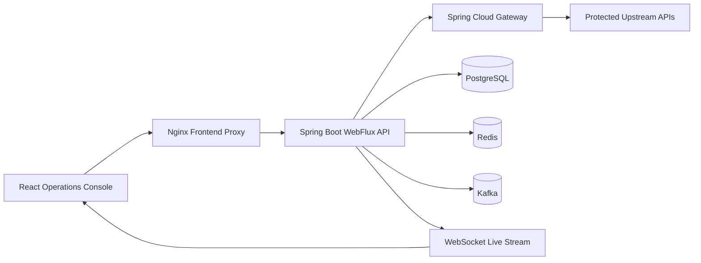
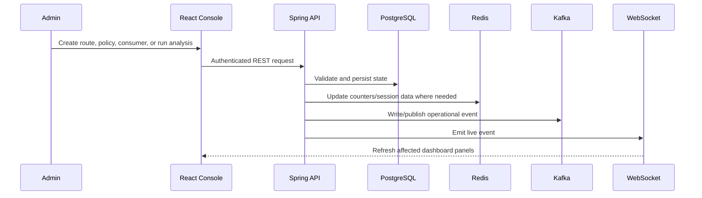

# Adaptive Gateway Platform

## Overview

Adaptive Gateway Platform is a production-style API gateway and security operations console for teams that need traffic-aware rate limiting, live operational visibility, anomaly detection, and auditable administration.

The project preserves the original adaptive API gateway idea and turns it into a deployable modular monolith: Spring Boot and Spring Cloud Gateway enforce routes and policies, PostgreSQL stores the system of record, Redis backs low-latency counters and session cache data, Kafka records operational events through an outbox flow, and a React TypeScript console gives administrators a live control surface.

## Problem Statement

Static API limits are often too rigid for real gateway traffic. They either block good clients during bursts or allow suspicious traffic until an operator manually investigates. Engineering teams also need traceable configuration changes, health checks, request history, and meaningful analytics without stitching together disconnected scripts.

## Solution

Adaptive Gateway Platform combines dynamic gateway configuration, Redis-backed rate-limit enforcement, persisted request decisions, analytics rollups, adaptive policy adjustments, anomaly detection, alerts, WebSocket live events, and an authenticated admin UI.

## Key Features

- JWT authentication with refresh tokens, BCrypt password hashing, and role-based admin access.
- PostgreSQL-backed upstream services, gateway routes, route predicates, policies, assignments, request logs, decisions, analytics, anomalies, alerts, and audit logs.
- Spring Cloud Gateway route loading from database configuration.
- Redis sliding-window rate-limit counters and session cache utilities.
- Kafka event publishing with a PostgreSQL outbox record.
- Adaptive learning that evaluates recent request history and adjusts policy strictness.
- Anomaly detection using persisted route metrics, rolling statistic snapshots, severity classification, and alert creation.
- Alert acknowledgement and resolution with audit records and live UI refresh.
- React TypeScript operations console with dashboard, gateway, rate-limit, consumer, operations, analytics, adaptive learning, and anomaly screens.
- WebSocket live event stream for request, analytics, adaptive, anomaly, alert, and audit updates.
- Docker Compose runtime for PostgreSQL, Redis, Kafka, backend, and frontend.
- GitHub Actions CI for backend tests, frontend audit/build, and Compose config validation.

## Architecture



The backend follows a modular monolith layout: `auth`, `gateway`, `ratelimit`, `adaptive`, `anomaly`, `alerts`, `analytics`, `consumer`, `operations`, `redis`, `kafka`, and `live`. Each feature follows controller to service to repository boundaries with DTO mappers and validation at API edges.

## Technology Stack

Frontend: React 18, TypeScript, Vite, Material UI, Redux Toolkit, Axios, Recharts.

Backend: Java 21, Spring Boot 4, Spring WebFlux, Spring Security, Spring Cloud Gateway, JPA/Hibernate, Flyway, Springdoc OpenAPI.

Database: PostgreSQL 16 with Flyway migrations, UUID primary keys, constraints, indexes, soft deletion, and audit tables.

Messaging/cache: Redis 7, Kafka 3.7.

DevOps: Docker, Docker Compose, Nginx, GitHub Actions.

## Screenshots

Screenshots are not committed yet because runtime visual capture requires the Docker stack to be running. The UI entrypoint is the authenticated operations console served by the frontend container.

## System Workflow



## AI/ML

The project uses explainable statistical intelligence instead of an unnecessary chatbot. Adaptive learning calculates route metrics from real request logs, builds traffic heatmap buckets, and creates strictness adjustments. Anomaly detection uses rolling statistics and z-score style thresholds to identify spikes, persist anomaly records, create alerts, and tighten affected policy strictness where appropriate.

## Cybersecurity

- BCrypt password hashes and durable refresh tokens stored as SHA-256 hashes.
- JWT access tokens signed with an environment-provided base64 secret.
- RBAC enforced through Spring Security authorities.
- Bean validation on request DTOs and pagination bounds.
- Global error envelopes with correlation IDs.
- Soft deletion for operational records.
- Credential generation uses `SecureRandom`; only credential hashes are stored.
- Secrets are configured through environment variables and `.env` is ignored.

## API Documentation

OpenAPI is available from the running backend:

- Swagger UI: `http://localhost:8080/swagger-ui.html`
- OpenAPI JSON: `http://localhost:8080/v3/api-docs`

See [docs/api.md](docs/api.md) for the main endpoint groups.

## Database

The schema is managed by Flyway at `backend/src/main/resources/db/migration/V1__initial_database_schema.sql`. It includes authentication, gateway configuration, rate limiting, analytics, adaptive learning, anomaly detection, alerts, Kafka outbox, and audit tables.

See [docs/database.md](docs/database.md).

## Installation

Prerequisites:

- Java 21+
- Maven 3.9+ or the included Maven Wrapper
- Node.js 22+
- Docker Desktop or another Docker Engine for full runtime verification

## Environment Variables

Copy `.env.example` to `.env` for local Docker execution and replace local-only secrets before any shared deployment:

```powershell
Copy-Item .env.example .env
```

Important variables include `POSTGRES_PASSWORD`, `JWT_SECRET_BASE64`, `REDIS_URL`, `KAFKA_BOOTSTRAP_SERVERS`, and exposed service ports.

## Running Locally

Backend tests:

```powershell
cd backend
.\mvnw.cmd test
```

Frontend build:

```powershell
cd frontend
npm ci
npm run build
```

Full stack:

```powershell
docker compose --env-file .env up --build
```

Then open `http://localhost:8088`.

## Docker Setup

`docker-compose.yml` starts PostgreSQL, Redis, Kafka, the backend, and the frontend. The frontend Nginx config proxies `/api` and WebSocket traffic to the backend container.

Run the deployment smoke test after the stack is healthy:

```powershell
.\scripts\deployment-smoke-test.ps1
```

## Testing

Current automated checks:

- Backend unit/service tests with Maven Surefire.
- Frontend TypeScript and production Vite build.
- Frontend dependency audit in CI.
- Docker Compose config validation in CI.

## CI/CD

GitHub Actions workflow: `.github/workflows/ci.yml`

Pipeline stages:

- Backend Java 21 setup and `./mvnw -B test`.
- Frontend Node 22 setup, `npm ci`, `npm audit --audit-level=moderate`, and `npm run build`.
- Docker Compose configuration validation with `.env.example`.

## Deployment

For local deployment, use Docker Compose. For cloud deployment, run PostgreSQL, Redis, Kafka, backend, and frontend as managed services or containers, provide production secrets through the platform secret manager, and expose the frontend behind TLS.

See [docs/deployment.md](docs/deployment.md).

## Security

Read [SECURITY.md](SECURITY.md) before publishing. Do not commit `.env`, private certificates, tokens, database dumps, or generated build artifacts.

## Performance

The runtime uses Redis for gateway-rate counters, database indexes for request and alert lookups, pagination for large lists, and asynchronous/live event paths where appropriate. Obvious bottlenecks are documented in [docs/development.md](docs/development.md).

## Future Enhancements

- End-to-end browser tests for the highest-value admin workflows.
- Prometheus/Grafana dashboard bundle for production metrics.
- Container image vulnerability scanning in CI once a registry target is chosen.
- Multi-role operator permissions beyond the current administrator console.
- Cloud deployment manifests for a selected target platform.

## Contributors

Maintained as a final-year engineering project and portfolio-grade gateway platform.

## License

Apache License 2.0. See [LICENSE](LICENSE).
