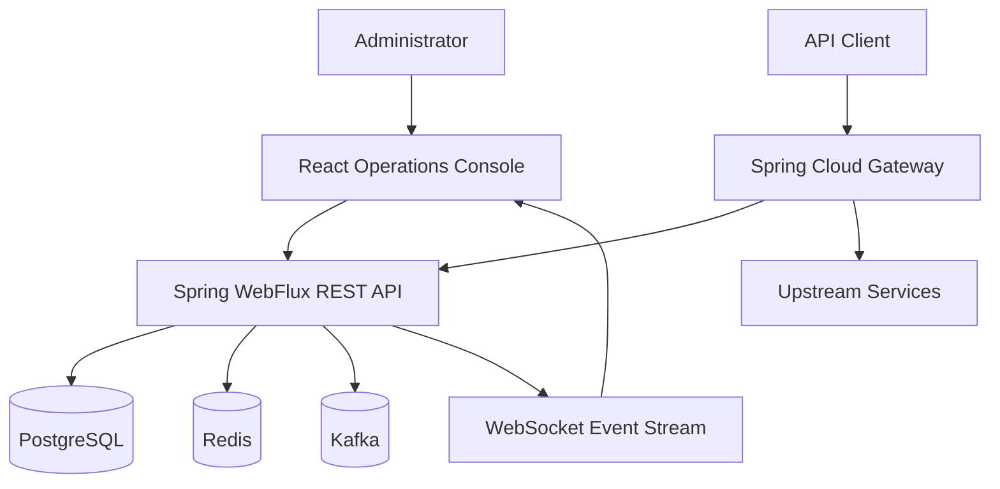
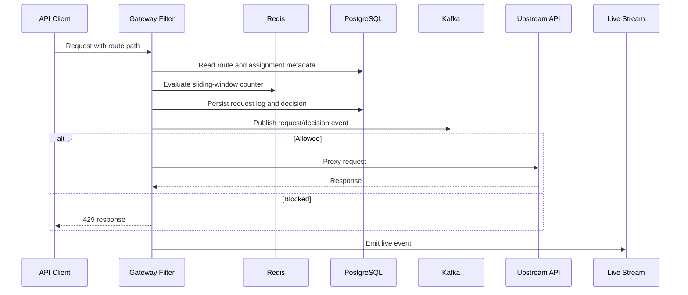

# Architecture

## Product Identity

Project name: Adaptive Gateway Platform

One-line description: A traffic-aware API gateway with adaptive rate limiting, anomaly detection, live operations, and an authenticated admin console.

Target users: platform engineers, security engineers, API administrators, and evaluators reviewing distributed systems depth.

Primary problem solved: static API gateway limits cannot respond intelligently to changing traffic or suspicious usage patterns.

Key differentiator: gateway decisions, analytics, adaptive learning, anomaly records, alerts, audit logs, and live UI updates are connected through real persistence and runtime services.

## System Context

## Backend Modules

- `auth`: setup admin, login, refresh, logout, current user, user registration.
- `gateway`: upstream service registry, database-backed routes, route refresh.
- `ratelimit`: policies, assignments, Redis counters, request decisions, enforcement filter.
- `adaptive`: route metric aggregation, heatmap buckets, strictness adjustments.
- `anomaly`: rolling statistics, anomaly records, alert creation.
- `alerts`: alert listing, acknowledgement, resolution, live alert events.
- `analytics`: rollups, client metrics, recent traffic summary.
- `consumer`: API consumers and one-time credential creation.
- `operations`: request history and audit logs.
- `redis`, `kafka`, `live`: infrastructure adapters.

## Runtime Path

## Design Decisions

- Modular monolith over microservices to keep the final-year project explainable and runnable from one backend artifact.
- PostgreSQL as source of truth; Redis and Kafka are runtime accelerators/integration components.
- Flyway-managed schema to avoid hidden ORM-generated database drift.
- React operations console consumes real REST APIs rather than static fixtures.
- WebSocket events refresh affected UI panels without generating fake real-time data.

## Phase Details

The original implementation notes are preserved as phase documents from `docs/phase-01-project-architecture.md` through `docs/phase-15-deployment.md`.
