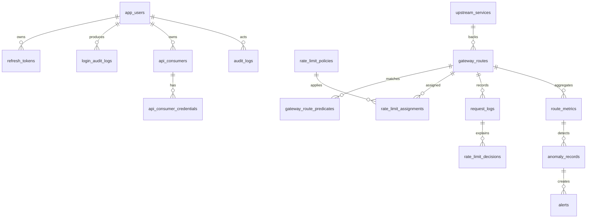

# Database

## Migration

The schema is created by Flyway migration:

`backend/src/main/resources/db/migration/V1__initial_database_schema.sql`

The application uses `spring.jpa.hibernate.ddl-auto=validate`, so runtime startup verifies entity/schema compatibility instead of silently changing tables.

## Entity Groups

## Security Controls

- Passwords are stored only as BCrypt hashes.
- Refresh tokens and API credentials are stored only as hashes.
- UUID primary keys reduce predictable identifier exposure.
- Soft-delete columns preserve operational history.
- Database constraints validate statuses, counts, rates, and alert consistency.
- Indexes support common list, filter, and audit lookup paths.

## Main Tables

- Authentication: `roles`, `app_users`, `refresh_tokens`, `login_audit_logs`.
- Gateway: `upstream_services`, `gateway_routes`, `gateway_route_predicates`.
- Rate limiting: `rate_limit_policies`, `rate_limit_assignments`, `request_logs`, `rate_limit_decisions`.
- Intelligence: `route_metrics`, `traffic_heatmap_buckets`, `rate_limit_adjustments`, `anomaly_stat_snapshots`, `anomaly_records`.
- Operations: `alerts`, `analytics_rollups`, `client_metrics`, `kafka_event_outbox`, `audit_logs`.

## Operational Guidance

- Use managed PostgreSQL backups before production migrations.
- Keep migration files immutable once published.
- Rotate credentials through environment variables or a cloud secret manager.
- Do not store raw API keys, refresh tokens, access tokens, or private certificates in the database.
