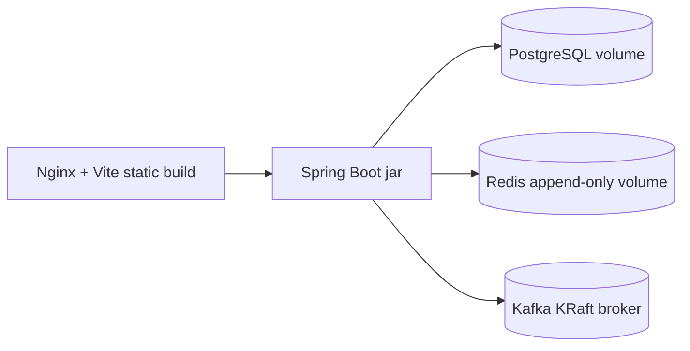

# Deployment

## Local Docker Deployment

1. Copy the environment template:

```powershell
Copy-Item .env.example .env
```

2. Replace local-only secrets in `.env`.

3. Build and start the stack:

```powershell
docker compose --env-file .env up --build
```

4. Open the frontend:

```text
http://localhost:8088
```

## Containers



## Health Checks

- Backend: `/actuator/health`
- Frontend: `/`
- PostgreSQL: `pg_isready`
- Redis: `redis-cli ping`
- Kafka: topic listing command in the Kafka container

## CI/CD

`.github/workflows/ci.yml` runs backend tests, frontend install/audit/build, and Docker Compose configuration validation.

## Production Notes

- Put the frontend behind TLS.
- Store secrets in the deployment platform secret manager.
- Use managed PostgreSQL, Redis, and Kafka where possible.
- Set `SPRING_PROFILES_ACTIVE=prod`.
- Rotate `JWT_SECRET_BASE64` before production use.
- Review exposed Actuator endpoints before internet-facing deployment.

## Smoke Test

After the stack is healthy:

```powershell
.\scripts\deployment-smoke-test.ps1
```
