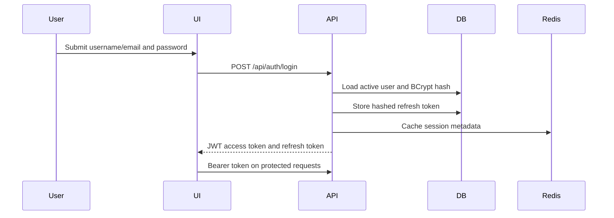

# Security

## Authentication Flow

## Implemented Controls

- BCrypt password hashing with a strength of 12.
- JWT access tokens signed with an environment-provided secret.
- Refresh-token rotation and logout revocation.
- API credential generation with `SecureRandom` and hash-only storage.
- Role-based route protection with Spring Security.
- Request validation through Jakarta Bean Validation.
- Global exception handling that returns stable codes without stack traces.
- Correlation IDs for tracing and support.
- Audit logging for sensitive administrative actions.
- Alert acknowledgement/resolution audit records.
- `.env` ignored by Git with `.env.example` for safe templates.

## Authorization Model

Administrative APIs require the configured admin authority. The first administrator can only be created through `/api/auth/setup-admin` while no active user exists.

## Sensitive Data

Never commit:

- `.env`
- real database passwords
- JWT secrets
- API keys
- private certificates
- database dumps
- generated frontend or backend build artifacts

## Remaining Hardening Opportunities

- Add account lockout and suspicious login throttling.
- Add refresh-token reuse detection.
- Split read-only operator and security responder roles.
- Add dependency and container scanning to CI once the publication target is selected.
- Add TLS and trusted reverse proxy configuration for deployed environments.
